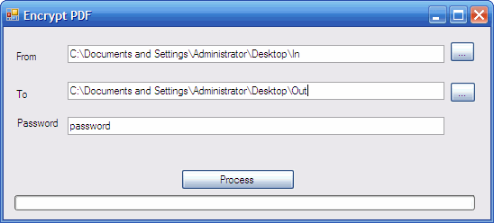

# Encrypt PDF

Originally posted here:
<https://www.codeproject.com/Articles/43116/Encrypt-PDF/?

## Introduction
This complete Windows application lets you password protect your PDF files in a given folder and its subfolders. It uses free iTextSharp library.

## Using the code
To use this program, simply select the source and the destination folders. It the program experiences any problems, it will create a log file (Log.txt) in the source folder.
